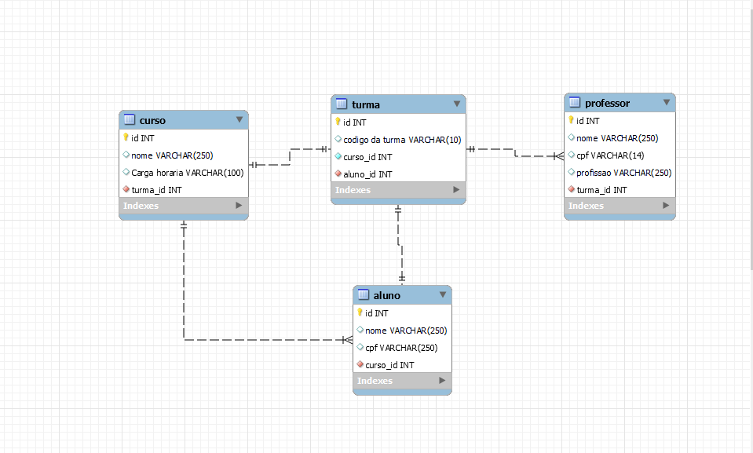

# Diagram_m4
Banco de Dados Resilia
Criando um banco de dados simples para o projeto do curso de Desenvolvimento Web da Resilia.

Projeto
Foi passado que tinhamos que criar um banco de dados para o curso Resília, depois responder perguntas sobre quais entidades existem e inserir registros.

Perguntas
⇨ Existem outras entidades além dessas três? Pensando em um modelo de curso, é possível pensar em outras entidades importantes para um banco de dados. Para esse trabalho, criei a entidade de "Alunos"

⇨ Quais são os principais campos e tipos? Os príncipais campos sao "Curso,Turma,Professor e Alunos" 

⇨ Como essas entidades estão relacionadas? As entidades estão ligadas por quato chaves estrageiras curso_id, aluno_id, turma_id.

  <h1> Diagrama Resilia<h1>
  

